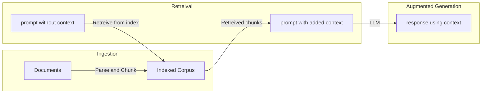

---
# You can also start simply with 'default'
theme: academic
# random image from a curated Unsplash collection by Anthony
# like them? see https://unsplash.com/collections/94734566/slidev
#background: 
# some information about your slides (markdown enabled)
title: RAG @ FORC 2025
info: |
  ## Slidev Starter Template
  Presentation slides for developers.

  Learn more at [Sli.dev](https://sli.dev)
# apply unocss classes to the current slide
class: text-center
# https://sli.dev/features/drawing
monaco: false
drawings:
  persist: false
# slide transition: https://sli.dev/guide/animations.html#slide-transitions
transition: slide-left
# enable MDC Syntax: https://sli.dev/features/mdc
mdc: true
# open graph
seoMeta:
  # By default, Slidev will use ./og-image.png if it exists,
  # or generate one from the first slide if not found.
  ogImage: auto
  # ogImage: https://cover.sli.dev

hideInToc: true
---

# Retrieval Augmented Generation
Foundations of Research Computing (FORC) Camp 2025

  <a href="https://github.com/slidevjs/slidev" target="_blank" class="slidev-icon-btn">
    <carbon:logo-github />
  </a>

<!--
The last comment block of each slide will be treated as slide notes. It will be visible and editable in Presenter Mode along with the slide. [Read more in the docs](https://sli.dev/guide/syntax.html#notes)
-->

---
hideInToc: true
---

# Table of contents

<Toc text-sm minDepth="1" maxDepth="1" />

---
transition: fade-out
---

# What is Retrieval Augmented Generation?

 
 

Retreival Augmented Generation is a technique to inject custom context to prompts when invoking an LLM. LLMs may be able to answer questions based on their training data, but the training 
data is frozen before the LLM is released for general use. 

 

  <b>
    To effectively investigate the contents of your customized corpus, you need to be able to pass along the relevant bits to the LLM based on the query.
  </b>

<!--
Here is another comment.
-->

---
layout: default
transition: fade-out
---
# Overview

Here's what we are trying to acheive:
 

  <b>
    What is an  index  ?
  </b>

  <b>
    How do we  retreive  relevant bits from an index?
  </b>

<!--
Here is another comment.
-->

---
layout: center
class: text-center
---

# Learn More

<PoweredBySlidev mt-10 />

